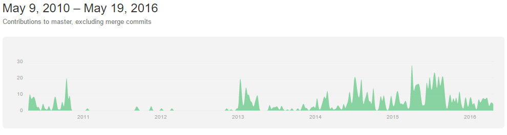
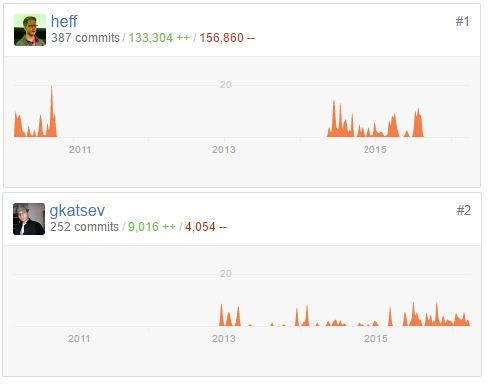
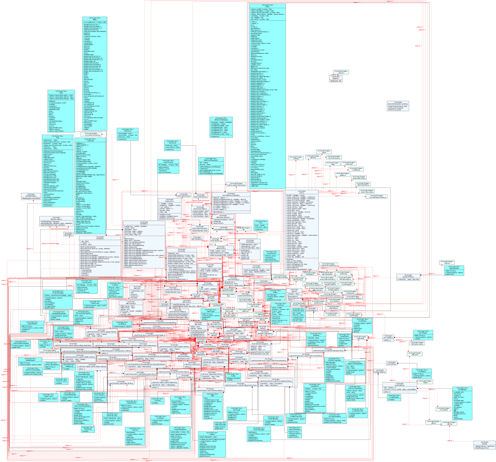

<!-- -->
<!-- -->
<!-- -->
<!-- -->


# [Video.js - HTML5 Video Player](http://videojs.com)

<!-- -->

**[Harel](https://github.com/harella1), [Nati](https://github.com/natiohayun), [Meir](https://github.com/mwindowshz), and [Pablo](https://github.com/pabloli)**<br/>
*Azriely Engeniring collage Jerusalem*

[](https://gitter.im/pabloli/ASOSMA?utm_source=badge&utm_medium=badge&utm_campaign=pr-badge&utm_content=badge)

**Abstract**

Is an open source video player.
Is active for 5 year.
Is a active project.

**Table of Contents**

* [VIDEO.JS - HTML5 Video Player]()

##	Introduction
Video.js is a web video player built from the ground up for an HTML5 world. It supports HTML5 and Flash video, as well as YouTube and Vimeo (through plugins). It supports video playback on desktops and mobile devices. This project was started mid 2010, and the player is now used on over 200,000 websites

Using Video for Everybody as the embed code means you know it’s compatible with many devices (including ones without javascript).
The javascript library fixes browser & device bugs, and makes sure your video is even more compatible across different browser versions.
The pure HTML5/CSS skin ensures a consistent look between HTML5 browsers, and easy custom skinning if you want to give it a specific look, or brand it with your own colors. See the skins page for examples of custom skins.
Free & Open Source
Lightweight. NO IMAGES USED
100% skinnable using CSS
Library independent
Easy to use
Easy to understand & extend
Consistent look between browsers
Full Screen & Full Window Modes
Volume Control
Forced fallback to Flash (even when there is an unsupported source)

##	Stakeholder Analysis
### Types of Stakeholders
#### Communicators
##### Developers
###### TC Commitee
The Video.js project is jointly governed by a Technical Steering Committee (TSC) which is responsible for high-level guidance of the project.
The TSC has final authority over this project including:

 - Technical direction
 - Project governance and process (including this policy)
 - Contribution policy
 - GitHub repository hosting
 - Conduct guidelines
 - Maintaining the list of additional collaborators

###### Collaborators
Modifications of the contents of the videojs/video.js repository are made on a collaborative basis. Anybody with a GitHub account may propose a modification via pull request and it will be considered by the project Collaborators. All pull requests must be reviewed and accepted by a Collaborator with sufficient expertise who is able to take full responsibility for the change
	
##### Developing Modules
- Core
- Skin
- Plugins

#### Testers
- Unit test

##### Users
######API

 - Player UI Features
 - 
	**Feature**|**Included**
---|:---:
Audio Player|No
Fullscreen|Yes
Subtitle Support|Yes
MediaRSS Playlist Support|No
Touch Interface|No
Keyboard Interface|No
Themeable|Yes
Advertising|No
Analytics|No


 - Platform Compatibility

	**OS**|**Support**
---|:---:
iOS|Yes
Android 1.x|Yes
Android 2.x|Yes
Blackberry|Yes


 - Embed Types Supported
	
	**Type**|**Support**
---|:---:
Flash Fallback|Yes
Flash Fallback Player|Flowplayer
Flash Embed Rewriting|No
Reads HTML5 Media Tags|Yes
iFrame Embedding|No
iFrame API|No

 -  API Compatibility

	**API**|Compatible
---|:---:
Flexible Embedding	|No
HTML5 Media Events|No
HTML5 Media API|No


######Known Users

 - Zencoder -- is the creator of an open-source HTML5 video player, Video.js, built with Javascript, HTML, and CSS. Video.js plays video via native playback in all HTML5 browsers and devices, or through Adobe Flash when HTML5 playback is not available. 

####  Community
- GitHub Repository
	- Repository life activity
	
	- Most active contributors                                             
	
- StackOverFlow Forum, is used for questions. All watchers will get emails for closed question responses.
	- Question answering guide:                                       


### Context Diagram
## Development Process
There is no too much information about the process but from the github record we can learn that the project start with only one developer  and now the project is been developed by a lot of active developers.
The bigger part of this project is the UI part.

VideoJS is an HTML5 Video Player with 3 core parts:

 - An embed code (Video for Everybody),
 - Javascript library (video.js)
 - Pure HTML/CSS skin (video-js.css).

The Javascript library (video.js) section is divided in 7 principal sections:

 - Control-Bar -- All the types of controls (i.e. Audio, Progress, Volume)
 - Menu -- All the menu components (i.e Buttons, Items)
 - Popup -- The Popup component is used to build pop up controls
 - Slider -- The base functionality for sliders like the volume bar and seek bar
 - Tech -- Module for media (HTML5 Video, Flash) controllers
 - Tracks -- Setup the common parts of an audio, video, or text track
 - Utils -- Various utilities

###Source code example
HTML 5
```
<h1>Responsive Video.js Example (v4.3)</h1>
  <p></p>
  <video id="my_video_1" class="video-js vjs-default-skin" controls preload="auto" 
  data-setup='{ "asdf": true }' poster="http://video-js.zencoder.com/oceans-clip.png" >
    <source src="http://vjs.zencdn.net/v/oceans.mp4" type='video/mp4'>
    <source src="http://vjs.zencdn.net/v/oceans.webm" type='video/webm'>
  </video>
``` 
JavaScript
```javascript
videojs.autoSetup();
    videojs('my_video_1').ready(function(){
      console.log(this.options()); //log all of the default videojs options
       // Store the video object
      var myPlayer = this, id = myPlayer.id();
      // Make up an aspect ratio
      var aspectRatio = 264/640; 
      function resizeVideoJS(){
        var width = document.getElementById(id).parentElement.offsetWidth;
        myPlayer.width(width).height( width * aspectRatio );
      }
      // Initialize resizeVideoJS()
      resizeVideoJS();
      // Then on resize call resizeVideoJS()
      window.onresize = resizeVideoJS; 
    });
```
##  Developer's Perspective
### Module Organization
#### Module Analysis

####  Class Diagram

### Common Processing
#### Change log file
Each version (stable or beta) has a text file with the changes of the version.
This file can includes:

 - Bug fixes
 - New features
 - Architecture changes
 - API changes
 - Additional notes

### Standardization of Design
### Standardization of Testing
### Codeline Organization
### Metrics
##  Conclusions and Recommendations
##  Bibliography
* https://github.com/videojs/video.js


